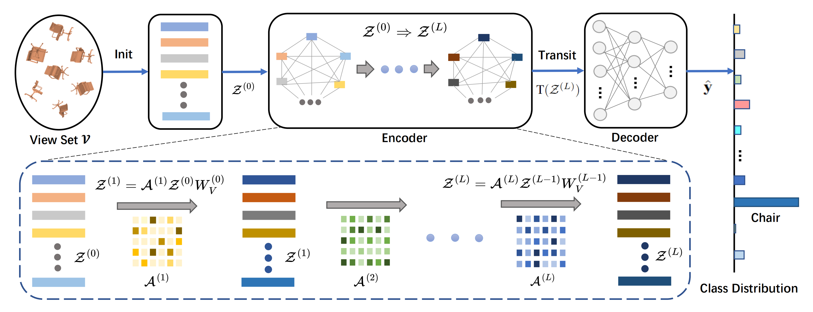

This repository is the official implementation of the paper "VSFormer: Mining Correlations in Flexible View Set for Multi-view 3D Shape Understanding", created by Hongyu Sun, Yongcai Wang, Peng Wang, Haoran Deng, Xudong Cai and Deying Li.



View-based methods have demonstrated promising performances in 3D shape understanding. However, they tend to make strong assumptions about the relations between views or learn the multi-view correlations indirectly, which limits the flexibility of exploring inter-view correlations and the effectiveness of target tasks. To overcome the above problems, this paper investigates flexible organization and explicit correlation learning for multiple views. In particular, we propose to incorporate different views of a 3D shape into a permutation-invariant set, referred to as View Set, which removes rigid relation assumptions  and facilitates adequate information exchange and fusion among views. Based on that, we devise a nimble Transformer model, named VSFormer, to explicitly capture pairwise and higher-order correlations of all elements in the set. Meanwhile, we theoretically reveal a natural correspondence between the Cartesian product of a view set and the correlation matrix in the attention mechanism, which supports our model design. Comprehensive experiments suggest that VSFormer has better flexibility, efficient inference efficiency and superior performance. Notably, VSFormer reaches state-of-the-art results on various 3d recognition datasets, including ModelNet40, ScanObjectNN and RGBD. It also establishes new records on the SHREC'17 retrieval benchmark. 

## Preparation
### Package Setup
* Ubuntu 18.04
* Python 3.7.15
* PyTorch 1.12.0
* CUDA 11.6
* torchvision 0.13.0
* timm 0.6.11
* einops 0.6.0
* wandb 0.12.11
* pueue & pueued 2.0.4

```shell
  conda create -n vsformer python=3.7.15
  codna activate vsformer

  pip install torch==1.12.0+cu116 torchvision==0.13.0+cu116 --extra-index-url https://download.pytorch.org/whl/cu116
  pip install -r requirements.txt
```

`pueue` is a shell command management software, we use it for scheduling the model training and evaluation tasks, please refer to the [official page](https://github.com/Nukesor/pueue) for installation and basic usage. 
We recommend this tool because under its help you can run the experiments at scale thus save your time. 

### W&B Server Setup
We track the model training and fine-tuning with W&B tools. The official W&B tools may be slow and unstable since 
they are on remote servers, we install the local version by running the following command. 

```shell
  docker run --rm -d -v wandb:/vol -p 28282:8080 --name wandb-local wandb/local:0.9.41
```

If you do not have Docker installed on your computer before, referring to the [official document](https://docs.docker.com/engine/install/ubuntu/) to finish Docker installation on Ubuntu.


### Nodejs Setup
To use the provided 3D shape retrieval toolkit that is implemented by JavaScript, you need to install `nodejs` as follows.
```shell
  sudo apt update
  sudo apt install nodejs
  sudo apt install npm
```

### Datasets
1. First of all, we prepared all used datasets well and saved them to [Baidu NetDisk](https://pan.baidu.com/s/1nwLnnBPVkpx8Q_tL8Hi3_w?pwd=xi9y). Just download!

2. Download the following datasets and extract them to the desired location on your computer. 
    1. [ModelNet10](https://data.airc.aist.go.jp/kanezaki.asako/data/modelnet10v2png_ori2.tar)
    2. [ModelNet40](https://data.airc.aist.go.jp/kanezaki.asako/data/modelnet40v2png_ori4.tar)
    3. [ScanObjectNN](https://pan.baidu.com/s/1fQLeSDgCsvWUc7dBiEco2Q?pwd=y1fj)
        - The used version is `OBJ_ONLY`
    4. [RGBD](https://rgbd-dataset.cs.washington.edu/dataset/)
    5. [SHREC17](https://shapenet.cs.stanford.edu/shrec17/)
        - Rendering `SHREC17` is time-consuming, so we provide the rendered version by ourselves, you can download it [here](https://pan.baidu.com/s/1MVBAybo5UC9Qpg-J5Gyv6w?pwd=72jx).
        - If you want to try it by yourself, follow [this project](https://github.com/kanezaki/SHREC2017_track3) to render the meshes to get the multiple views

3. The directories of the above datasets should be organized as follow. 
    ```
    |- vsformer
    |---- data
    |-------- ModelNet10
    |-------- ModelNet40
    |-------- ScanObjectNN
    |-------- RGBD
    |-------- SHREC17
    ```
    The `data` directory is at the same level with `models`, `scripts`, etc.

## Usage
### 3D Shape Recognition
1. To train and evaluate on ModelNet10, run
    ```shell
    ./scripts/MN10-V20-L4H8D512-MR2-Alex-1.sh
    ```

2. To train and evaluate on ModelNet40, run
    ```shell
    ./scripts/MN40-V20-L4H8D512-MR2-Alex-1.sh
    ```

3. To train and evaluate on ScanObjectNN, run
    ```shell
    ./scripts/SONN-V20-L4H8D512-MR2-Alex-1.sh
    ```

4. To train and evaluate on RGBD, run
    ```shell
    ./scripts/RGBD-V12-L4H8D512-MR2-Alex-1.sh
    ```

### 3D Shape Retrieval
1. To train and evaluate the classification performance on SHREC17, run
    ```shell
    ./scripts/SH17-V20-L4H8D512-MR2-RN18-1.sh
    ./scripts/SH17_sub-V20-L4H8D512-MR2-RN18-1.sh
    ```

2. Change the work directory and make new directories that are used to save the retrieval results
    ```shell
    cd retrieval
    mkdir -p evaluator/vsformer
    mkdir -p evaluator/final_vsformer
    ```

3. Retrieve shapes that have same class as the query to generate rank list $L_1$
    ```shell
    # 8 arguments: <file> <initializer> <rank> <num_decoder_layers> <method_name> <exp_name> <normal/perturbed> <batch_size>
    python shrec17.py val.csv alexnet 0 2 vsformer SH17-V20-L4H8D512-MR2-RN18-1 normal 132 
    ```

4. Retrieve shapes that have same subclass as the query to generate rank list $L_2$
    ```shell
    # 8 arguments: <file> <initializer> <rank> <num_decoder_layers> <method_name> <exp_name> <normal/perturbed> <batch_size>
    python shrec17_sub.py val.csv alexnet 1 2 vsformer SH17_sub-V20-L4H8D512-MR2-RN18-1 normal 132 
    ```

5. Re-rank $L_1$ according to $L_2$ to produce the final rank list 
    ```shell
    # 2 arguments: <method_name> <split_version>
    python shrec17_rerank.py vsformer val_normal
    ```

6. Evaluate the retrieval performance
    ```shell
    cd evaluator
    # NOTE: The `/` is necessary at the end of the command
    node --max-old-space-size=8192 evaluate.js final_vsformer/
    ```

7. Replace `val.csv` with `test.csv` and re-run steps 3-6 to get the results of test split

### Citation
If you find our paper or code is helpful for your project, please consider citing our paper as follows
```bibtex
@article{sun24vsformer,
    author={Sun, Hongyu and Wang, Yongcai and Wang, Peng and Deng, Haoran and Cai, Xudong and Li, Deying}, 
    journal={IEEE Transactions on Visualization and Computer Graphics submission}, 
    title={VSFormer: Mining Correlations in Flexible View Set for Multi-view 3D Shape Understanding},
    year={2024}
}
```

### Contact
If you have any question about our work, please create new or search related issues in this repository.
